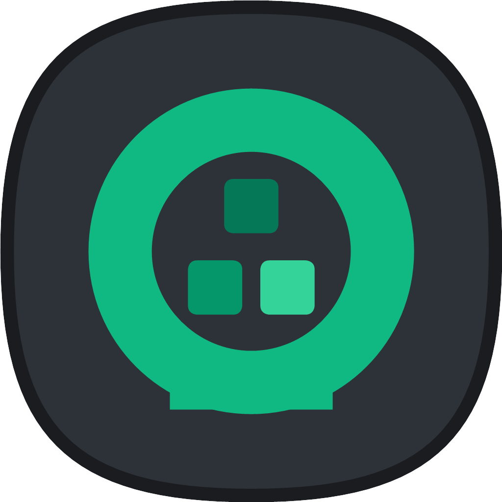

  <h1>
     
     
    KeePassXL
  </h1>

  <!-- Badges en fila horizontal -->
  
  
  
  

**KeePassXL** (Cross-Platform Language / Mnemonic) is a modern, secure, and open-source password manager evolved from the original KeePassXC core. While preserving 100% compatibility with the offline KDBX encrypted format, KeePassXL bridges the critical gap between rigorous mathematical cryptography and real-world human memory. 

Traditional single-language Diceware methods generate chaotic, disconnected strings of text that humans struggle to visualize. This psychological friction often drives users to lower their word count or write master keys down. **KeePassXL introduces an Advanced Multi-Language Grammatical Passphrase Generator**, allowing advanced power-users to build custom linguistic templates that weave dynamic vocabulary from separate uncorrelated databases (e.g., English, Spanish, German, Quechua, Nahuatl) alongside custom connector strings, *CamelCase* enforcement, and localized trailing safety patterns. 

By creating an unpredictable "Blind Entropy" sentence structure, KeePassXL effectively breaks modern threat models—including massive neural-network password crackers (such as PassGAN) and AI-driven token probability optimizations—while keeping your master key profoundly memorable.

---

## ⚡ The Evolution: Intelligent Passphrases

Under the **Passphrase -> Advanced** tab, KeePassXL expands your security matrix without changing the core database security schema:

* **Blind Cross-Language Entropy:** Breaks single-language standard dictionaries. Attackers cannot predict linguistic syntax switches or multi-dictionary interleaving.
* **Semantic Mnemonic Blueprints:** Define your own structural rules using placeholders (`[Word:ES]`, `[Word:EN]`, `[Pattern:ddd]`) to anchor complex phrases to your natural associative memory.
* **Prototyped for the Real World:** We target current, AI-accelerated automated cracking systems by making the passphrase grammatical structure itself an unguessable secret variable known only to the user.

---

## Features List

KeePassXL inherits all the rock-solid, production-grade features of the KeePassXC codebase while focusing our independent pipeline on generator upgrades.

### Core Features
* **Format Stability:** Create, open, and save standard databases in the KDBX format (Fully compatible with KeePass, KeePassXC, Strongbox, and KeePassDX).
* **Advanced Password & Passphrase Generator** with multi-dictionary and hybrid semantic syntax support.
* **Full Encryption at Rest:** Sensitive keys are strictly isolated in memory and never exposed outside the runtime environment.
* **Local First:** Operates entirely offline—giving you total control over where to store your encrypted vault, from local drives to secure self-hosted clouds.
* **Browser Integration:** Native handshake with Google Chrome, Mozilla Firefox, Microsoft Edge, Chromium, Vivaldi, Brave, and Tor-Browser (including Passkeys support).
* **Hardware Token Security:** Integrated YubiKey and OnlyKey challenge-response authentication mechanisms.
* **Data Migration:** Easy import pipelines from CSV, 1Password, Bitwarden, Proton Pass, and legacy formats.

### Advanced Capabilities
* **System Integrations:** SSH Agent integration and FreeDesktop.org Secret Service capabilities (to seamlessly replace Gnome Keyring, etc.).
* **Command Line Utility:** Full access to your vault via `keepassxl-cli`.
* **Deep Diagnostic Reports:** Database password health tracking, HIBP (Have I Been Pwned) integration, and password auditing statistics.
* **Cipher Choices:** AES-256, Twofish, and ChaCha20 encryption standards.

---

## 🛠️ Building & Contributing

KeePassXL is natively built on a powerful, cross-platform **C++ (Qt)** architecture. Modifying code in Windows compiles identically for Linux or macOS. 

### Development Roadmap & Community Help
Our core cryptographic upgrade is currently actively developed on Windows environments. We are a community-first fork that rejects rigid developmental constraints. 
* **If you are a C++ / Qt developer (especially on Linux or macOS):** We are actively looking for contributors to help optimize our dynamic string parser pull-requests and maintain deployment packages (.deb, Flatpak, .dmg).
* To learn how to build the application from source code, please review the [Build and Install](./INSTALL.md) guide.

Please check our [Issue Tracker](https://github.com) and filter by the **"Help Wanted"** label to see how you can help advance real-world password security.

---

## Generative AI & Code Integrity

We acknowledge that Generative AI is a standard element of modern development environments. Contributions leveraging AI assistants or automated agents are welcome, provided they go through our thorough review process. **Any automated or vibe-coded PR submissions must be transparently documented in the pull request.** Security and rigorous code inspection remain absolute.

---

## License

KeePassXL is proudly community-driven open-source software licensed under the **GPL-2 or GPL-3**. In accordance with the General Public License copyleft terms, this codebase remains fully open, free, and accessible to the public forever. Additional licensing details for third-party files can be found in the [COPYING](./COPYING) file.
