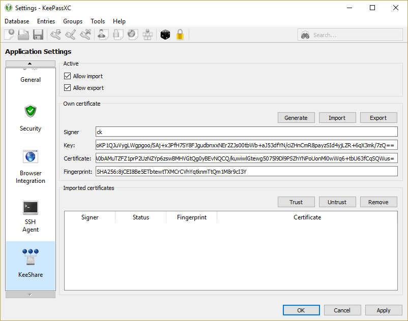
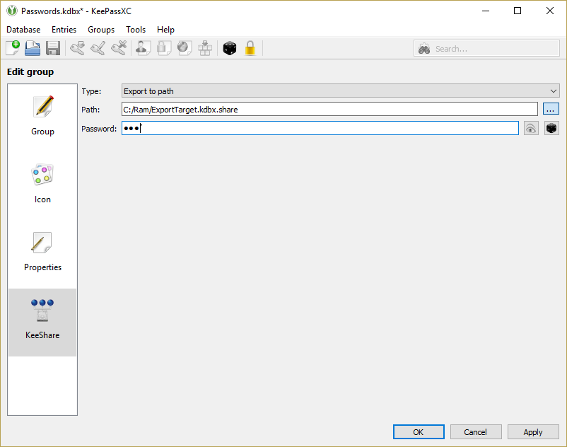
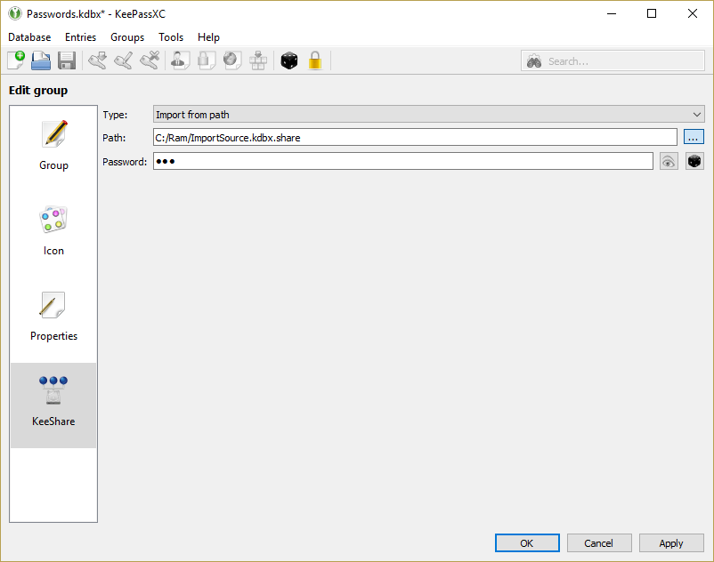
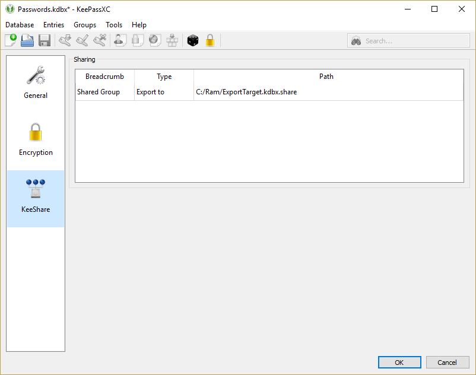

# Quick Start for KeePassXC

This procedure gets KeePassXC running on your computer with browser integration, using the pre-built binaries available for [download](https://keepassxc.org/download) from [KeePassXC site](https://keepassxc.org).

**TL;DR** KeePassXC saves your passwords securely.
When you double-click a URL in KeePassXC, it launches your default browser to that URL.
With browser integration configured, KeePassXC automatically enters username/password credentials into web page fields.

## Installing and Starting KeePassXC

1. [Download the native installer](https://keepassxc.org/download) and install KeePassXC for your  Windows, macOS, or Linux computer in the usual way for your platform.
1. Open the KeePassXC application.
1. Create a new database and give it a master key that's used to unlock the database file. 
This database holds entries (usernames, passwords, account numbers, notes) for all your websites, programs, etc.
1. Create a few entries - enter the username, password, URL, and optionally notes about the entry.
1. KeePassXC securely stores those entries in the database.

## Setting up Browser Integration with KeePassXC

1. *Within KeePassXC*, go to **Tools &rarr; Settings** (on macOS, go to **KeePassXC &rarr; Preferences**).
1. In **Browser Integration**, check **Enable KeePassXC browser integration**.
1. Right below that, click the checkbox for the browser(s) you use. 
Leave the other options at their defaults.
1. *In your default web browser,* install the KeePassXC Browser extension/add-on. Instructions for [Firefox or Tor Browser](https://addons.mozilla.org/firefox/addon/keepassxc-browser/) or [Chrome or Chromium](https://chrome.google.com/webstore/detail/keepassxc-browser/oboonakemofpalcgghocfoadofidjkkk).
1. Click the KeePassXC icon in the upper-right corner. You'll see the dialog below.
1. Click the blue Connect button to make the browser extension connect to the KeePassXC application.

&nbsp;

7. *Switch back to KeePassXC.* You'll see a dialog (below) indicating that a request to connect has arrived.
7. Give the connection a name (perhaps *Keepass-Browsername*, any unique name will suffice) and click OK to accept it.
7. This one-time operation connects KeePassXC and your browser.

## Using Browser Integration

1. *Within KeePassXC,* double-click the URL of an entry, or select it and type Ctrl+U (Cmd+U on macOS).
1. Your browser opens to that URL.
1. If there are username/password fields on that page, you will see the dialog below. 
Click *Allow* to confirm that KeePassXC may access the credentials to auto-fill the fields.
1. Check *Remember this decision* to allow this each time you visit the page.

## Using Sharing

Sharing allows you to share a subset of your credentials with others and vice versa.

### Enable Sharing

To use sharing, you need to enable for the application.

1. Go to Tools &rarr; Settings.
1. Select the category KeeShare.
1. Check _Allow import_ if you want to import shared credentials.
1. Check _Allow export_ if you want to share credentials.

To make sure that your data is valid when imported by another client, please _generate_ (or _import_) a public/private key pair and enter your _signer_ name. This way your client may verify that the imported data is valid. When Importing, you'll see the known sources with names and fingerprint in the list at the bottom. This is the place to _trust_ or _untrust_ signers. It is only possible to trust someone on application level.

### Sharing Credentials

If you checked _Allow export_ in the Sharing settings you now are good to go to share some passwords with others. Sharing always is defined on a group. If you enable sharing on a group, every entry under this group or its children is shared. If you enable sharing on the root node, **every password** inside your database gets shared!

1. Open the edit sheet on a group you want to share.
1. Select the sharing section.
1. Choose _Export to path_ as the sharing method.
1. Choose a path to store the shared credentials to.
1. Generate a password for this share container.

The export file will not be generated automatically. Instead, each time the database is saved, the file gets written (so please deactivate the autosafe feature). If an old file is present, the old file will be overwritten! The file should be written to a location that is accessible by others. An easy setup is a network share or storing the file inside the cloud.

### Using Shared Credentials

Checking _Allow import_ in the Sharing settings of the database enables you to receive credentials from others. KeePass will watch sharing sources and import any changes immediately into your database using the synchronization feature.

1. Create a group for import.
1. Open the edit sheet on that group.
1. Select the sharing section.
1. Choose _Import from path_ as the sharing method.
1. Choose a share container that is shared with you.
1. Enter the password for the shared container.

KeeShare observes the container for changes and merges them into your database when necessary. Importing merges in time order, so older data is moved to the history, which should have a sufficient size to prevent loss of needed data.

Please note, that the import currently is not restricted to the configured group. Every entry which was imported and moved outside the import group will be updated regardless of it's location!

### Using Synchronized Credentials

Instead of using different groups for sharing and importing you can use a single group that acts as both. This way you can synchronize a number of credentials easily across many users without a lot of hassle.

1. Open the edit sheet on a group you want to synchronize.
1. Select the sharing section.
1. Choose _Synchronize with path_ as the sharing method.
1. Choose a database that you want to use a synchronization file.
1. Enter the password for the database.

### Disable Sharing for Credentials

In case you don't want to share (import or export) some credentials, it is possible to you can 
* use the application settings and uncheck the options or 
* instead of selecting _Import from path_, _Export to path_ or _Synchronize with path_ you'll select _Inactive_ while leaving the path and the password untouched.

### Sharing overview

There is a simple overview of shared groups to keep track of your data.

1. Open the Database Settings.
1. Select the KeeShare category.

## Technical Details and Limitations of Sharing

Sharing relies on the combination of file exports and imports as well as the synchronization mechanism provided by KeePassXC. Since the merge algorithm uses the history of entries to prevent data loss, this history must be enabled and have a sufficient size. Furthermore, the merge algorithm is location independend, therefore it does not matter if entries are moved outside of an import group. These entries will be updated none the less. Moving entries outside of export groups will prevent a further export of the entry, but it will not ensure that the already shared data will be removed from any client.

KeeShare uses a custom certification mechanism to ensure that the source of the data is the expected one. This ensures that the data was exported by the signer but it is not possible to detect if someone replaced the data with an older version from a valid signer. To prevent this, the container could be placed at a location which is only writeable for valid signers.

## Using Auto Open

The Auto Open feature automatically loads and unlocks additional databases when you unlock your main database.
In order to use this functionnality, do the following:

1. Create a group called **AutoOpen** at the root of your main database.
1. In this group, create a new entry for each database that should be opened automatically:
    * Put the *password of the database* in the **Password** field
    * Put the *path to the database's file* in the **URL** field* (it can be formatted either as **file://**, a **/path/to/the/file** form, or a relative file path.)
    * If the extra database requires a keyfile to be unlocked, put the *path to the keyfile* in the **Username** field. The path options are the same as for the database's file in the URL field.
1. The next time you unlock your database these databases will be opened and unlocked automatically.
