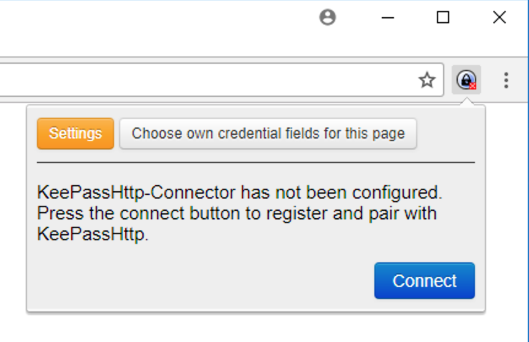
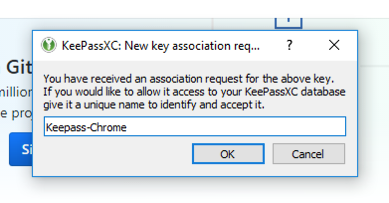
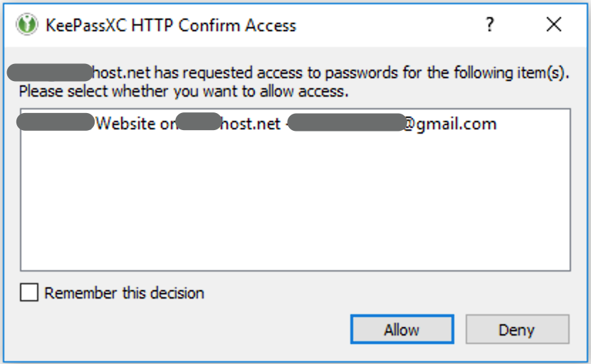

# Quick Start for KeePassXC

This procedure gets KeePassXC running on your computer with browser integration, 
using the pre-built binaries available for [download](https://keepassxc.org/download) 
from [KeePassXC site](https://keepassxc.org).

**TL;DR** KeePassXC saves your passwords securely.
When you double-click a URL in KeePassXC, it launches your default browser to that URL.
With browser integration configured, KeePassXC automatically enters 
username/password credentials into web page fields.

## Installing and Starting KeePassXC

* [Download the native installer](https://keepassxc.org/download) and install 
KeePassXC for your  Windows, macOS, or Linux computer in the usual way for your platform.
* Open the KeePassXC application.
* Create a new database and give it a master key that's used to unlock the database file. 
This database holds entries (usernames, passwords, account numbers, notes) 
for all your websites, programs, etc.
* Create a few entries - enter the username, password, URL, and optionally notes about the entry.
* KeePassXC securely stores those entries in the database.

## Setting up Browser Integration with KeePassXC

* *Within KeePassXC*, go to **Tools->Settings** (on macOS, go to **KeePassXC->Preferences**.) 
* In **Browser Integration**, check **Enable KeePassXC browser integration**
* Right below that, click the checkbox for the browser(s) you use
Leave the other options at their defaults.
* *In your default web browser,* install the KeePassXC Browser extension/add-on. Instructions for [Firefox](https://addons.mozilla.org/en-US/firefox/addon/keepassxc-browser/) or [Chrome](https://chrome.google.com/webstore/detail/keepassxc-browser/oboonakemofpalcgghocfoadofidjkkk)
* Click the KeePassXC icon in the upper-right corner. You'll see the dialog below. 
* Click the blue Connect button to make the browser extension connect to the KeePassXC application. 

* *Switch back to KeePassXC.* You'll see a dialog (below) indicating that a request to connect has arrived. 
* Give the connection a name (perhaps *Keepass-Browsername*, any unique name will suffice) and click OK to accept it.
* This one-time operation connects KeePassXC and your browser.

## Using Browser Integration

* *Within KeePassXC,* double-click the URL of an entry,
or select it and type Ctrl+U (Cmd+U on macOS).
* Your browser opens to that URL.
* If there are username/password fields on that page, you will see the dialog below.
Click *Allow* to confirm that KeePassXC may access the credentials to auto-fill the fields. 
* Check *Remember this decision* to allow this each time you visit the page.

